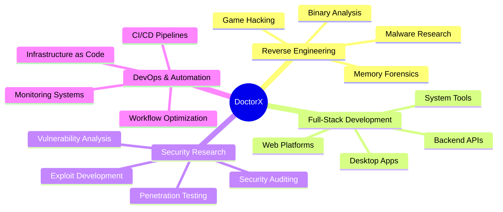

<div align="center">


<p align="center">
  <a href="#"></a>
  <a href="#"></a>
  <a href="#"></a>
</p>

<p align="center">
  
</p>

</div>

---

## 👋 About Me

> *Passionate engineer specialized in reverse engineering, security research, and building robust full-stack applications.*

I architect and develop **secure, high-performance systems** from the ground up. My expertise bridges **low-level binary analysis** and **modern software engineering**, with deep focus on security, clean code, and system optimization.

### 🎯 Core Expertise

```yaml
Reverse Engineering:
  - Binary Analysis: IDA Pro, Ghidra, x64dbg, Radare2
  - Malware Research: Unpacking, deobfuscation, behavior analysis
  - Memory Engineering: Game hacking, instrumentation, debugging
  
Backend Development:
  - Languages: Go, Node.js, C#/.NET
  - Databases: MongoDB, PostgreSQL, Redis
  - Architecture: RESTful APIs, microservices, scalable systems
  
Desktop Applications:
  - Frameworks: WinForms, WPF, Avalonia UI
  - Integration: WebView2, native modules, system APIs
  - Focus: Automation tools, security utilities, dev tools
  
System Programming:
  - Linux: GNOME extensions, shell scripting, system automation
  - DevOps: CI/CD pipelines, monitoring, infrastructure
  - Tools: Custom utilities, workflow enhancement
```

---

## 🛠️ Technical Arsenal

### Languages & Frameworks

<p align="center">
  
  
  
  
  
  
  
</p>

### Backend & Databases

<p align="center">
  
  
  
  
  
  
</p>

### Frontend & UI

<p align="center">
  
  
  
  
</p>

### Security & Reverse Engineering

<p align="center">
  
  
  
  
  
  
</p>

### Development Tools

<p align="center">
  
  
  
  
  
</p>

---

## 💼 What I Build

<table>
<tr>
<td width="33%" valign="top">

### 🔧 Desktop Applications
- **Automation suites** for enterprise workflows
- **Developer tools** and IDE extensions
- **Security utilities** and analysis tools
- Cross-platform apps with Avalonia & WPF
- Native Windows applications
- WebView2 integration projects

</td>
<td width="33%" valign="top">

### 🌐 Backend Systems
- **RESTful APIs** and microservices
- **Authentication systems** & secure storage
- **Real-time messaging** platforms
- Database architecture & optimization
- Campaign management systems
- Queue processing & job scheduling

</td>
<td width="33%" valign="top">

### 🛡️ Security Tools
- **Binary analysis** frameworks
- **Deobfuscation** engines
- **Memory scanning** utilities
- **Game hacking** tools
- Unpacking & reverse engineering
- Malware behavior research

</td>
</tr>
</table>

---

## 🐧 Linux & System Expertise

I create powerful tools and automation for Linux environments:

<table>
<tr>
<td width="50%">

### 📦 What I Build
- **GNOME Extensions** — Desktop customization
- **Shell Scripts** — Workflow automation
- **System Monitors** — Service health checks
- **Developer Tools** — Productivity enhancers
- **Build Systems** — Custom toolchains
- **Deployment Scripts** — CI/CD automation

</td>
<td width="50%">

### 🔄 Service Auto-Recovery Script

```bash
#!/bin/bash
# Intelligent service health monitor

SERVICE="backend.service"
LOG_FILE="/var/log/service-monitor.log"
MAX_RETRIES=3
retry_count=0

log_message() {
    echo "[$(date '+%Y-%m-%d %H:%M:%S')] $1" | tee -a "$LOG_FILE"
}

while true; do
    if ! systemctl is-active --quiet "$SERVICE"; then
        retry_count=$((retry_count + 1))
        log_message "⚠️  Service down (Attempt $retry_count/$MAX_RETRIES)"
        
        systemctl restart "$SERVICE"
        sleep 2
        
        if systemctl is-active --quiet "$SERVICE"; then
            log_message "✅ Service restored"
            retry_count=0
        elif [ $retry_count -ge $MAX_RETRIES ]; then
            log_message "🚨 CRITICAL: Max retries reached!"
            # Send alert notification
            retry_count=0
        fi
    fi
    sleep 3
done
```

</td>
</tr>
</table>

---

## 📊 GitHub Statistics

<div align="center">
  
  
</div>

<div align="center">
  
</div>

<div align="center">
  
</div>

---

## 🎯 Focus Areas

<div align="center">



</div>

---

## 🤝 Let's Connect

<div align="center">

[](mailto:your.email@example.com)
[](https://linkedin.com/in/yourprofile)
[](https://twitter.com/yourhandle)
[](https://discord.com/users/yourid)
[](https://t.me/yourusername)

</div>

---

<div align="center">

### 💭 Philosophy

*"The best way to understand a system is to take it apart. The best way to secure it is to know how it breaks."*

### 🌟 Open for Collaboration

I'm interested in challenging projects involving **reverse engineering**, **security research**, **high-performance systems**, and **innovative tooling**.

---


**⭐ If you find my work interesting, consider starring my repositories!**

</div>
